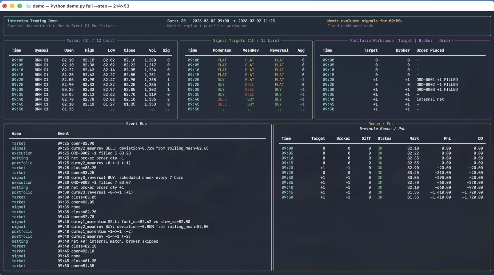
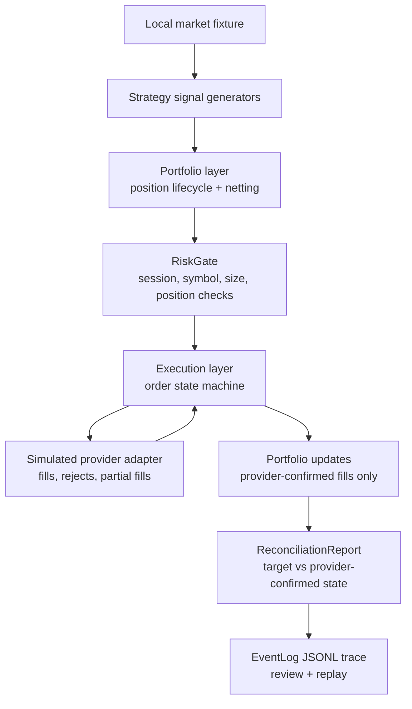

# Trading Infrastructure Proof Artifact

This repository is a public, anonymized proof artifact for trading
infrastructure design judgment. It runs locally and shows how strategy intent,
portfolio state, risk decisions, provider-confirmed state, reconciliation, and
trace review can stay separated by explicit boundaries.

The strategies are intentionally simple. The point is not alpha; the point is
state ownership, failure handling, and operator-visible evidence.



## What This Proves

- Deterministic local market-fixture replay through a small event loop
- Strategy signal generation that emits intent without mutating portfolio state
- Per-strategy position lifecycle and cross-strategy netting
- Pre-routing risk decisions through `RiskGate`
- Provider adapter behavior for fills, rejects, partial fills, and unexpected state
- Provider-confirmed state tracked separately from internal target state
- Reconciliation reports with target, provider state, diff, status, suspected source, and related event ids
- Ordered JSONL traces written to `artifacts/latest-run/events.jsonl`
- Trace replay that reconstructs final provider-confirmed position from callbacks

## What This Does Not Prove

- It is not investment advice.
- It is not a profitable strategy.
- It is not connected to a real service provider.
- It is not a reusable production trading stack.
- It does not disclose vendor names, provider names, middleware names, production topology, real symbols, or proprietary scale.
- It does not include deployment, credentials, persistent storage, alerting, auth, or live operations.

## Architecture



The production-shaped idea is simple: strategy intent, portfolio target state,
risk decisions, provider callbacks, and reconciliation should not share hidden
state. This repository keeps those responsibilities visible while using local
fixtures and a simulated provider adapter so it remains safe to publish.

More detail:

- [Architecture](docs/architecture.md)
- [Failure modes](docs/failure-modes.md)
- [Reconciliation](docs/reconciliation.md)
- [Public disclosure](docs/public-disclosure.md)

## Quick Start

This runs locally with no credentials, external services, databases, message
middleware, or service-provider access.

```bash
python3 -m venv .venv
source .venv/bin/activate
python3 -m pip install -r requirements.txt
python3 demo.py full
```

For the fixed operator-console walkthrough:

```bash
python3 demo.py full --step
```

Use a wide terminal for console mode.

## Scenario Guide

```bash
python3 demo.py market-signal
python3 demo.py netting
python3 demo.py execution
python3 demo.py reconciliation
python3 demo.py risk-reject
python3 demo.py provider-reject
python3 demo.py partial-fill
python3 demo.py reconciliation-mismatch
python3 demo.py trace-replay
python3 demo.py unexpected-provider-state
```

The failure-oriented scenarios are the most useful review path:

| Scenario | Boundary shown |
| --- | --- |
| `risk-reject` | Invalid intent is stopped before provider routing. |
| `provider-reject` | Accepted risk does not imply provider-confirmed execution. |
| `partial-fill` | Residual quantity remains explicit after a partial callback. |
| `reconciliation-mismatch` | Target state and provider-confirmed state can diverge and be reported. |
| `trace-replay` | Provider-confirmed position can be reconstructed from JSONL callback events. |
| `unexpected-provider-state` | An unexpected callback state is surfaced for reconciliation review. |

Each run writes the latest trace to:

```text
artifacts/latest-run/events.jsonl
```

Generated artifacts are intentionally ignored by git.

## Project Structure

```text
demo.py
interview_demo/
├── data.py              # local market fixture loader
├── dashboard.py         # step-through operator console
├── strategies.py        # simple signal generators
├── portfolio.py         # position lifecycle, netting, attribution
├── risk.py              # pre-routing risk gate
├── execution.py         # order state machine + simulated provider adapter
├── events.py            # ordered event log + JSONL replay helper
├── reconciliation.py    # target vs provider-confirmed report
├── performance.py       # drawdown and summary statistics
└── runner.py            # full run and focused scenarios
```

The package name is historical. Public docs describe the artifact as an
anonymized trading infrastructure proof, not as a role-specific demo.

## Design Notes

**Strategy intent is not execution**

Strategies consume replayed market events and emit target intent. They do not
submit orders, mutate provider state, or mark fills.

**Portfolio owns target state**

The portfolio layer owns per-strategy position lifecycle, aggregate target
state, internal netting, and attribution. If opposing strategy demand nets to
zero, the system updates internal strategy positions without provider-bound
flow.

**Risk rejection and provider rejection are separate**

`RiskGate` evaluates session state, enabled symbols, max order size, and max
aggregate position before routing. A provider reject happens later, after an
intent has passed risk and reached the simulated provider adapter.

**Provider-confirmed state is the source for fills**

Submission is not execution. Full position updates are applied only after
provider-confirmed fills; partial fills remain explicit residual state for
reconciliation and review.

**Reconciliation is a workflow**

Monitoring can show whether a run is alive. Reconciliation checks whether the
recorded target state and provider-confirmed state agree, then points review
toward likely sources of drift.

## Verify

```bash
python3 -m unittest discover -s tests
python3 demo.py full
python3 demo.py risk-reject
python3 demo.py provider-reject
python3 demo.py partial-fill
python3 demo.py reconciliation-mismatch
python3 demo.py trace-replay
python3 demo.py unexpected-provider-state
```

## License

All rights reserved. This repository is published as a non-proprietary portfolio
and discussion artifact. You may view and run the code for evaluation, but reuse,
redistribution, or commercial use requires permission from the copyright holder.
