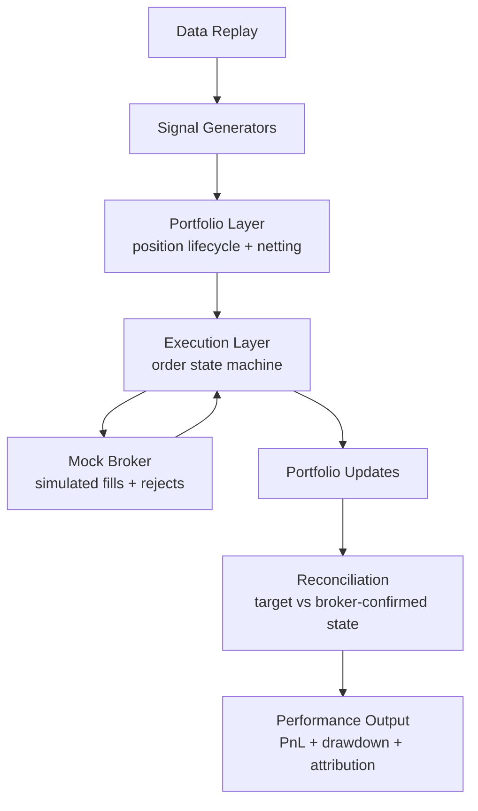

# Systematic Trading Infrastructure Demo

A self-contained Python demo of an end-to-end automated trading workflow:
historical replay, signal generation, portfolio netting, mock execution,
reconciliation, and performance reporting.

This project is about production trading system design, not strategy alpha. The
strategies are intentionally simple so the architecture stays visible.


## Purpose

This repository is a reviewer-friendly proof point for how I think about
systematic trading infrastructure. It is meant to be easy to inspect, easy to
run, and concrete enough to support a technical conversation about the boundary
between research, portfolio state, execution, reconciliation, and operations.

If you only have two minutes:

1. Look at the dashboard screenshot above.
2. Skim the architecture section below.
3. Run `python3 demo.py full` to see the full replay.
4. Run `python3 demo.py netting` and `python3 demo.py reconciliation` to see two
   production-relevant boundaries in isolation.

The strategies are dummy strategies. The proof point is the workflow: replayable
inputs, stable intent boundaries, broker-confirmed state, internal netting,
reconciliation, and performance attribution.

## What This Shows

- Historical 5-minute market data replay through a deterministic event loop
- Independent strategy signal generation
- Per-strategy position lifecycle and cross-strategy portfolio netting
- Explicit order state management through a mock broker boundary
- Target-versus-broker reconciliation
- PnL, drawdown, win rate, and per-strategy attribution

## What This Is Not

- Not investment advice
- Not a profitable trading strategy
- Not connected to a real broker or exchange
- Not HFT or sub-millisecond infrastructure
- Not proprietary employer code or data

## Architecture



The production version of this shape would replace the local adapters with live
market-data capture, a real broker adapter, persistent logs, pre-trade risk
checks, monitoring, alerting, secrets management, and replay tooling. The main
point is to keep strategy intent, portfolio state, execution state, and
reconciliation separated by explicit boundaries.

## Quick Start

This demo only needs Python and one terminal UI dependency. It does not require
Redis, broker credentials, market-data subscriptions, databases, or background
services.

Use Python 3.10 or newer. The code uses postponed annotations for Python 3.9
compatibility, but Python 3.10+ is the recommended runtime for a clean local
setup.

### macOS / Linux

1. Open Terminal.

2. Clone the repository and enter the project folder:

```bash
git clone <repo-url>
cd systematic-trading-infra-demo
```

If you downloaded the project as a ZIP file instead, unzip it and `cd` into the
unzipped folder.

3. Check that Python is installed:

```bash
python3 --version
```

Expected result: `Python 3.10.x` or newer.

If `python3` is not found, install Python from
[python.org](https://www.python.org/downloads/) or through your package manager.

4. Create a virtual environment:

```bash
python3 -m venv .venv
```

5. Activate the virtual environment:

```bash
source .venv/bin/activate
```

Expected result: your prompt usually starts with `(.venv)`.

6. Install dependencies:

```bash
python3 -m pip install --upgrade pip
python3 -m pip install -r requirements.txt
```

7. Run the demo:

```bash
python3 demo.py full
```

8. Run the interactive dashboard:

```bash
python3 demo.py full --step
```

Use a wide terminal for dashboard mode. Around 160 columns or wider works best.

### Windows PowerShell

1. Open PowerShell.

2. Clone the repository and enter the project folder:

```powershell
git clone <repo-url>
cd systematic-trading-infra-demo
```

If you downloaded the project as a ZIP file instead, unzip it and `cd` into the
unzipped folder.

3. Check that Python is installed:

```powershell
py -3 --version
```

Expected result: `Python 3.10.x` or newer.

If `py` is not found, install Python from
[python.org](https://www.python.org/downloads/). During installation, enable
`Add python.exe to PATH`.

4. Create a virtual environment:

```powershell
py -3 -m venv .venv
```

5. Activate the virtual environment:

```powershell
.\.venv\Scripts\Activate.ps1
```

Expected result: your prompt usually starts with `(.venv)`.

If PowerShell blocks activation, run this once and then activate again:

```powershell
Set-ExecutionPolicy -Scope CurrentUser RemoteSigned
```

6. Install dependencies:

```powershell
python -m pip install --upgrade pip
python -m pip install -r requirements.txt
```

7. Run the demo:

```powershell
python demo.py full
```

8. Run the interactive dashboard:

```powershell
python demo.py full --step
```

Use a wide terminal for dashboard mode. Around 160 columns or wider works best.

### Dashboard Controls

When running `python3 demo.py full --step` or `python demo.py full --step`:

| Key | Behavior |
| --- | --- |
| Space | Advance one internal step |
| Enter | Run one 5-minute market cycle |
| Esc | Run the rest of the demo |

### Verify The Install

macOS / Linux:

```bash
python3 demo.py execution
python3 demo.py reconciliation
python3 -m unittest discover -s tests
python3 -m compileall demo.py interview_demo
```

Windows PowerShell:

```powershell
python demo.py execution
python demo.py reconciliation
python -m unittest discover -s tests
python -m compileall demo.py interview_demo
```

All commands should complete without errors.

If `compileall` fails because your Python installation tries to write bytecode
outside the project directory, use this on macOS / Linux:

```bash
PYTHONPYCACHEPREFIX=/tmp/trading-demo-pycache python3 -m compileall demo.py interview_demo
```

Or this on Windows PowerShell:

```powershell
$env:PYTHONPYCACHEPREFIX="$env:TEMP\trading-demo-pycache"
python -m compileall demo.py interview_demo
```

### Troubleshooting

- `ModuleNotFoundError: No module named 'rich'`: activate the virtual environment
  and run `pip install -r requirements.txt` again.
- `python3: command not found`: install Python 3.10+ and reopen the terminal.
- `py` is not recognized on Windows: reinstall Python and enable
  `Add python.exe to PATH`.
- Dashboard layout looks cramped: make the terminal wider or run
  `python3 demo.py full` for the scrolling output mode.

## Focused Scenarios

```bash
python3 demo.py market-signal
python3 demo.py netting
python3 demo.py execution
python3 demo.py reconciliation
```

These scenarios isolate the system boundaries that are most useful to discuss:
market data to signal intent, cross-strategy netting, order state transitions,
and reconciliation mismatch detection.

## Tests

The test suite uses Python's built-in `unittest` module, so there is no separate
test dependency.

```bash
python3 -m unittest discover -s tests
```

On Windows PowerShell:

```powershell
python -m unittest discover -s tests
```

## Project Structure

```text
demo.py
interview_demo/
├── data.py              # local CSV loader + deterministic market fixture
├── dashboard.py         # Rich Live dashboard for step-through mode
├── strategies.py        # simple signal generators
├── portfolio.py         # position lifecycle, netting, attribution
├── execution.py         # order state machine + mock broker
├── reconciliation.py    # target vs broker-confirmed state checks
├── performance.py       # drawdown and Sharpe-like statistics
└── runner.py            # full demo and focused scenario runners
```

Private notes are intentionally not part of the public project. Keep the
published repository focused on the runnable demo and public-safe design notes.

## Design Highlights

**Research-to-live boundary**

Strategies emit intent only. They do not mutate portfolio state and they do not
talk to execution. That keeps research logic separated from live trading
consequences.

**Portfolio as the decision boundary**

The portfolio layer owns per-strategy position lifecycle, aggregate target state,
cross-strategy netting, and attribution. If opposing strategy demand nets to
zero, the system updates internal strategy positions without sending unnecessary
broker flow.

**Execution as a state machine**

Submission is not execution. The execution layer tracks explicit order states and
only treats broker-confirmed fills as position-changing events.

**Reconciliation as a first-class workflow**

Monitoring tells you whether the system is alive. Reconciliation tells you
whether the recorded past is internally consistent. This demo includes both a
passing final reconciliation and a focused mismatch scenario.

## Example Output

The full run ends with aggregate reconciliation and performance output:

```text
Reconciliation: PASS
portfolio position matches broker-confirmed fills

total_pnl              -1,220.00
max_drawdown           -2,730.00
sharpe_like                -0.46
total_strategy_trades         18
closed_trades                 14
win_rate                   42.9%
```

Negative PnL is expected in this fixture. The strategies are dummy strategies
designed to exercise the workflow; the output is meant to support investigation
of attribution, drawdown, turnover, execution cost, and reconciliation behavior.

## Production Extensions

- Immutable market, signal, order, fill, and broker-callback logs
- Pre-trade risk checks for position limits, order size, session state, and
  strategy-level controls
- Partial fills, cancels, bounded retries, disconnect recovery, and kill-switch
  behavior
- Live market-data capture, normalization, storage, and replay
- Secrets handling, auth, environment separation, deployment, monitoring, and
  alerting

## License

All rights reserved. This repository is published as a non-proprietary portfolio
and discussion artifact. You may view and run the code for evaluation, but reuse,
redistribution, or commercial use requires permission from the copyright holder.
