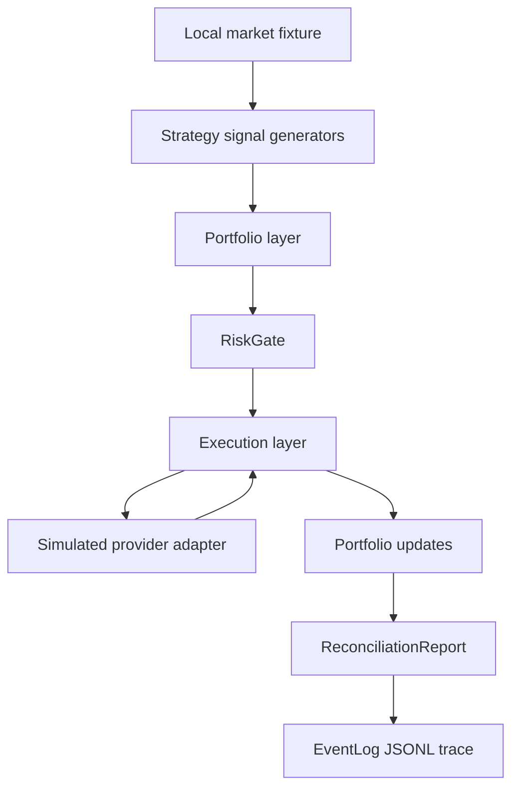

# Architecture

This repository is a public-safe trading infrastructure proof artifact. It uses
local fixtures and a simulated provider adapter to show state boundaries without
publishing vendor names, provider names, middleware names, real instruments,
production topology, or proprietary scale.

## Runtime Shape

The code runs in one process. That is intentional: the artifact should be easy
to inspect and safe to publish. The architectural boundary still matters because
each layer owns a different kind of truth.

## State Ownership

| Layer | Owns | Does not own |
| --- | --- | --- |
| Strategy generators | Signal intent from replayed market events | Portfolio mutation, order routing, fills |
| Portfolio layer | Per-strategy lifecycle, aggregate target state, netting, attribution | Provider callback truth |
| `RiskGate` | Pre-routing accept/reject decisions | Provider state or retry policy |
| Execution layer | Order state machine and provider callbacks | Strategy intent or alpha logic |
| Simulated provider adapter | Provider-confirmed callback state for the local run | Real connectivity or live operations |
| Reconciliation | Target-vs-provider comparison and suspected-source categorization | Automatic repair |
| `EventLog` | Ordered trace evidence for review and replay | Durable production event storage |

## Demo Shape vs Production Shape

The artifact demonstrates boundaries, not a production deployment. A production
system would likely replace local fixtures with market-data capture, the
in-process trace with durable event storage, and the simulated provider adapter
with a real service-provider adapter. Those components are deliberately omitted.

The important design constraint is stable ownership:

- Strategy code emits intent.
- Portfolio code decides target changes and netting.
- Risk code blocks invalid provider-bound flow.
- Execution code waits for provider-confirmed callbacks.
- Reconciliation code compares internal target state to provider-confirmed state.
- Trace code preserves the event sequence for later review.

## Implemented Event Flow

The full run and focused scenarios append structured records such as:

- `market_event_loaded`
- `signal_emitted`
- `portfolio_intent_built`
- `risk_decision`
- `order_submitted`
- `provider_callback`
- `reconciliation_result`

The latest run writes `artifacts/latest-run/events.jsonl`. The trace replay
scenario loads that JSONL and reconstructs provider-confirmed position from
provider callback events.

## Public-Safe Limits

This repo does not describe live deployment, named middleware, service-provider
integration details, credentials, account structure, environment layout, real
symbol lists, capacity, or performance-envelope claims. It is a compact proof of judgment
around state boundaries and failure review, not a blueprint for operating a
trading system.
